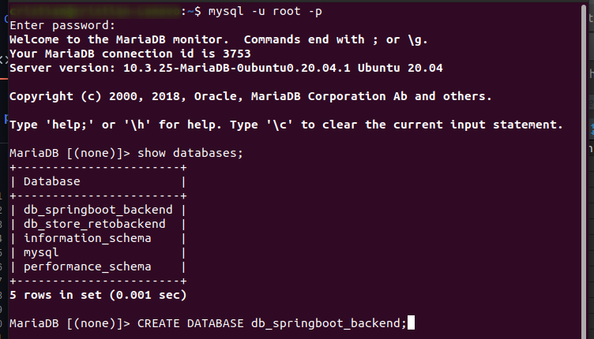
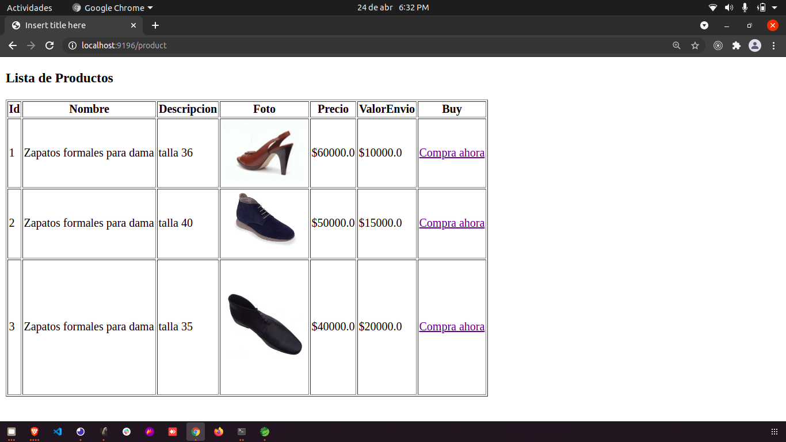
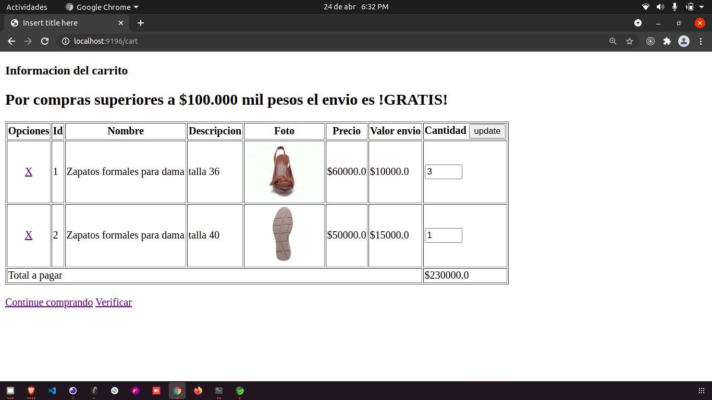
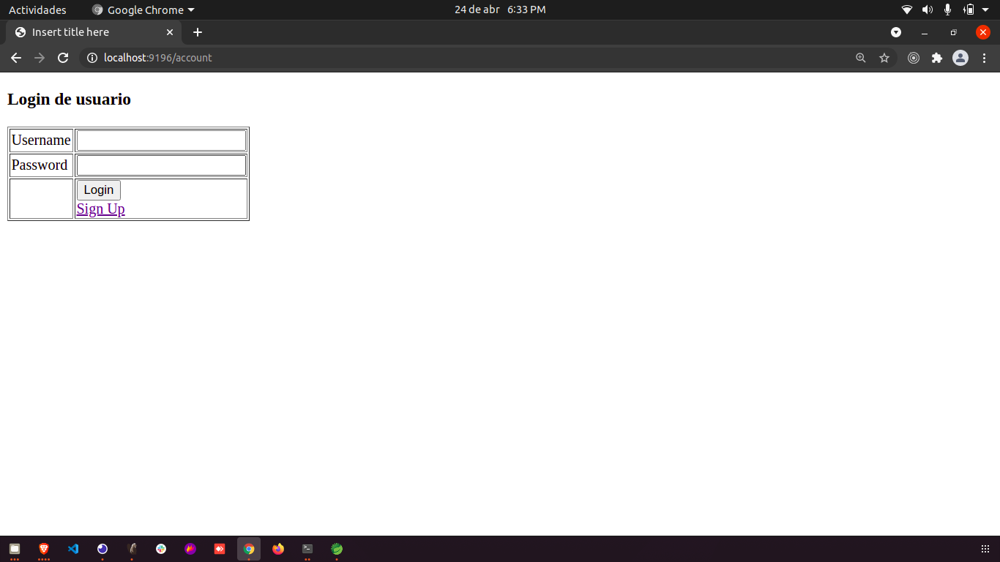
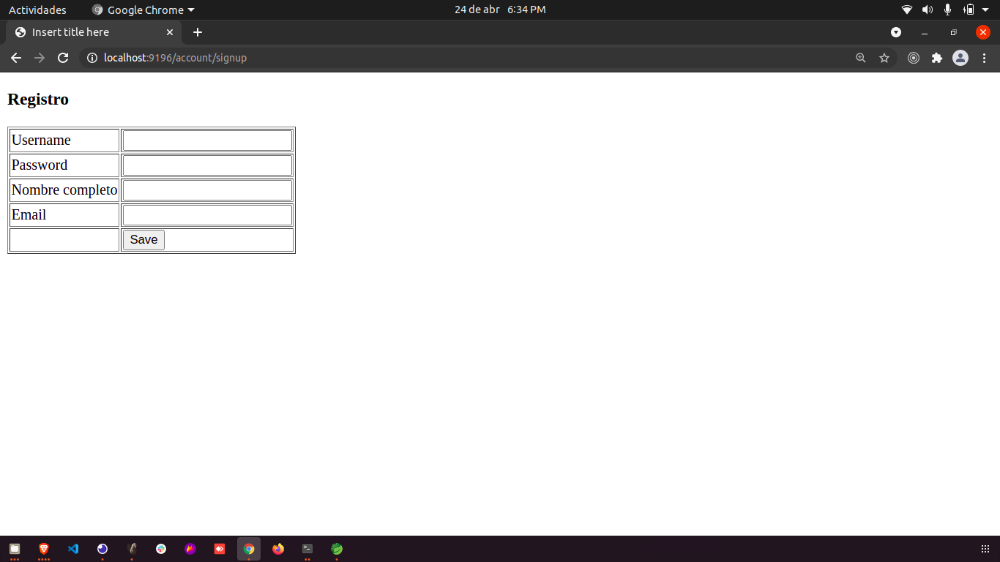

# Prueba-Backend-SpringBoot

Desarrolado en SpringTools, usando lenguaje Java.
El reto es el siguiente:


- "Dado un cliente con la cedula de ciudadanía 12345 y con la dirección carrera 11# 14-08, cuando el
cliente selecciona los productos a comprar con un valor mayor de 70.000 pesos entonces el sistema
genera la factura con el iva (Impuesto del 19%) y el valor del domicilio."

 - "Dado un cliente con la cedula de ciudadanía 12345 y con la dirección carrera 11# 14-08, cuando el
cliente selecciona los productos a comprar con un valor mayor de 100.000 pesos entonces el sistema genera la factura con el iva (Impuesto del 19%) y el valor del domicilio en 0 pesos."


- "Dado que un cliente quiere agregar a su pedido un nuevo producto cuando el pedido era por valor de 70 mil pesos y al agregar el nuevo producto el pedido pasa de 100 mil pesos entonces el sistema debe de restar el valor del domicilio."


## Descargar y descomprimir el repositorio
```
https://github.com/cristianvergel5/prueba-springboot-backend.git
```

## Creando Database


## Pasos para deplegar el proyecto de forma local

Importar el proyecto en SpringTools
```
SpringBoot -> Import -> Maven -> Existing Maven Proyects > Ruta Local
```


## Configuracion de SpringBoot -> application.properties

Username y password del usuario (Acceso a BD) 
```
spring.datasource.url=jdbc:mysql://localhost:3306/db_springboot_backend
spring.datasource.username=root
spring.datasource.password =
spring.jpa.hibernate.naming.implicit-strategy= org.hibernate.boot.model.naming.ImplicitNamingStrategyLegacyJpaImpl
spring.jpa.hibernate.naming.physical-strategy= org.hibernate.boot.model.naming.PhysicalNamingStrategyStandardImpl
spring.jpa.hibernate.ddl-auto=create-drop
logging.level.org.hibernate.SQL = debug


spring.thymeleaf.prefix=classpath:/templates/
spring.thymeleaf.suffix=.html
spring.thymeleaf.mode=HTML5
spring.thymeleaf.encoding=UTF-8
spring.thymeleaf.servlet.content-type=text/html; charset=utf-8; 
spring.thymeleaf.cache=true

server.port=9196
```
## Ejecutar
  ```
    Click derecho sobre el Proyecto -> Run As -> Spring Boot App
```

## Link Deploy
```
Login = http://localhost:9196/account 
Lista de Productos = http://localhost:9196/product
Todas las ordenes = http://localhost:9196/orders
```

## Funcionamiento y vistas.
### Las vistas son una plantilla de Html basica, sirven para mostrar los datos del BackEnd.
El usuario (No registrado) podra ver los productos.

El usuario para pruebas es:
```
username: usuario
password: 1234
```
# Vista Productos

# Vista Carrito

# Vista Login

# Vista SignUp



